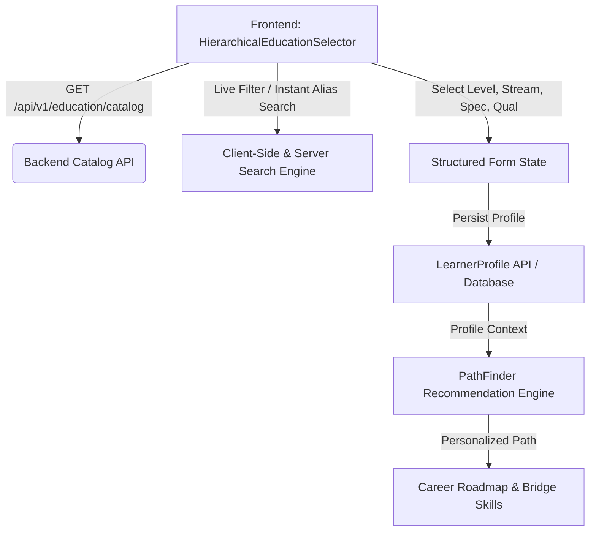

# 🇮🇳 India-Specific Education & Stream Taxonomy Implementation Report

**Project**: AI PathFinder  
**Module**: Education & Stream Taxonomy System (JanSahay / SIH26101 Normalized Standards)  
**Status**: Completed & Verified  
**Date**: September 2026  

---

## 1. Executive Summary

To make **AI PathFinder** deeply attuned to the Indian educational landscape, we replaced rigid, flat dropdowns with an **India-Specific Hierarchical Education & Stream Taxonomy**. The system models how students and professionals in India actually progress through education—from Secondary School (Classes 9–10) through ITI, Polytechnic, Undergraduate (19 broad disciplines), Postgraduate, Professional degrees, and Vocational training.

Key innovations implemented:
1. **4-Level Cascading Hierarchy**: $\text{Education Level} \longrightarrow \text{Broad Stream / Field} \longrightarrow \text{Specialization / Subjects} \longrightarrow \text{Qualification}$.
2. **Normalized Taxonomy & Alias Matching**: Instant search with fuzzy alias resolution (e.g. typing `CSE` maps to Computer Science Engineering; `PCM` maps to Physics, Chemistry, Mathematics; `ITI COPA` maps to Computer Operator & Programming Assistant).
3. **Domain Agnosticism**: Education serves as a rich contextual signal for personalized skill gap analysis, study plans, and career guidance—**not** an artificial lockout from any high-growth tech or creative careers.
4. **Resilient Data Storage**: Structured relational columns paired with a flexible `education_profile` JSON object, custom text fallback (`custom_education_label`), institution, and completion year.

---

## 2. Architecture & Data Flow



---

## 3. Normalized Taxonomy Structure

The catalog is managed centrally via `backend/app/core/education_catalog.py` and mirrored for low-latency offline fallback in `frontend/src/lib/educationCatalog.ts`.

### 3.1 The 10 Normalized Education Levels

| Level Code | Display Name | Sub-Streams & Highlights |
| :--- | :--- | :--- |
| `secondary_school` | Secondary School (Classes 9–10) | General / Integrated, Science-oriented, Mathematics / Computational, Social Science / Humanities, Arts, Physical Education, Vocational / Skill |
| `higher_secondary` | Higher Secondary (Classes 11–12) | Science (PCM, PCB, PCMB, CS/IT), Commerce (With/Without Maths, Informatics), Humanities / Arts, Vocational / Applied |
| `diploma_polytechnic` | Diploma / Polytechnic | Engineering & Tech (Mechanical, Civil, EE, ECE, CSE), Commercial Practice, Pharmacy, Architecture, Design |
| `iti_trade` | ITI / Industrial Training | Engineering Trades (Electrician, Fitter, Turner, Machinist, MMV), Non-Engineering Trades (COPA, Stenography, DTP) |
| `undergraduate` | Undergraduate (College / Degree) | **19 Disciplines**: Engineering & Tech, Computer Applications & IT, Management, Commerce, Natural Sciences, Medicine & Allied Health, Law, Humanities, Design, Media, Agriculture, Pharmacy, etc. |
| `postgraduate` | Postgraduate (Master's / PG Diploma) | Advanced specializations across Engineering (M.Tech), IT (MCA), Management (MBA), Sciences (M.Sc), Commerce (M.Com), Arts (MA) |
| `professional_degree` | Professional Degree / Certification | CA, CS, CMA, CFA, MBBS, LLB, LLM, Bar Council, Architecture Council |
| `vocational_skill` | Vocational / Skill Education | PMKVY, NSDC Sectors (IT-ITeS, Telecom, Healthcare, Electronics, Automotive, Retail, Logistics, Capital Goods) |
| `certification` | Certificate / Micro-Credential | Industry certifications (AWS, Google, Microsoft, Meta, Cisco, Kubernetes, NPTEL/Swayam) |
| `other` | Other / Custom | Unlisted qualifications with customizable free-text entry |

### 3.2 Instant Alias Resolution Engine

The search engine features comprehensive alias expansion for Indian academic nomenclature:
- `CSE`, `CS`, `CE` $\rightarrow$ Computer Science & Engineering
- `ECE` $\rightarrow$ Electronics & Communication Engineering
- `EEE` $\rightarrow$ Electrical & Electronics Engineering
- `MECH`, `ME` $\rightarrow$ Mechanical Engineering
- `CIVIL`, `CE` $\rightarrow$ Civil Engineering
- `BCA`, `MCA` $\rightarrow$ Bachelor / Master of Computer Applications
- `PCM`, `PCB`, `PCMB` $\rightarrow$ Physics, Chemistry, Math / Biology streams in Class 11–12
- `COPA`, `ITI COPA` $\rightarrow$ Computer Operator and Programming Assistant
- `MBBS`, `BDS`, `BAMS`, `BHMS` $\rightarrow$ Medical & Dental qualifications
- `BBA`, `MBA`, `PGDM` $\rightarrow$ Management qualifications
- `CA`, `CS`, `ICWA`, `CMA` $\rightarrow$ Chartered Accountancy & Finance professions

---

## 4. Backend Implementation Details

### 4.1 Core Catalog Engine (`backend/app/core/education_catalog.py`)
- Defines `EducationLevel`, `EducationStream`, `EducationSpecialization`, and `EducationTaxonomyCatalog`.
- Houses the complete 10-level Indian curriculum and vocational mapping.
- Implements `search_catalog(query, limit)` searching across level names, stream names, specializations, qualifications, and keyword aliases.

### 4.2 REST Endpoints (`backend/app/api/v1/education.py`)
- `GET /api/v1/education/catalog`: Returns the complete normalized taxonomy tree with versioning and total level/stream count.
- `GET /api/v1/education/search?q={query}&limit=10`: Returns ranked matches with breadcrumb trails (e.g. `Undergraduate > Engineering & Technology > Computer Science & Engineering (B.E. / B.Tech)`).
- Registered under `/api/v1` in `backend/app/main.py`.

### 4.3 Database Schema Migration (`backend/app/models/profile.py`)
Extended the `LearnerProfile` SQLModel with:
- `country`: Default `'India'`
- `education_stage`: Educational hierarchy level
- `education_domain`: High-level domain
- `education_stream`: Broad stream / branch
- `specialization`: Detailed major or subject combination
- `qualification`: Formal degree / certificate tag
- `institution`: School / College / Training Institute name
- `graduation_year`: Completion or anticipated graduation year
- `custom_education_label`: User-defined string if "Other / Custom" is chosen
- `education_profile`: JSON column capturing snapshot data, extra subjects, and metadata

Migration script `scripts/migrate_india_taxonomy.py` was executed, adding all columns safely with SQLite `PRAGMA table_info` introspection.

---

## 5. Frontend Implementation Details

### 5.1 Reusable Cascading Component (`HierarchicalEducationSelector.tsx`)
Located at `frontend/src/components/education/HierarchicalEducationSelector.tsx`:
- **Progressive Disclosure**: Only shows stream when level is selected, specialization when stream is selected, qualification when specialization is selected.
- **Smart Alias Search Bar**: Top quick-search input allowing users to type shortcuts like "CSE", "BCA", "PCM", or "Electrician" to instantly auto-populate all 4 cascade levels in one click.
- **"Other / Custom" Fallback**: Present at each level; when selected, cleanly reveals a text input for `custom_education_label`.
- **Keyboard Navigation & ARIA**: Full keyboard accessibility (`Enter`, `Tab`, `Escape`, `Arrow keys`), ARIA combobox attributes, and high-contrast styling adhering to PathFinder's dark theme palette.
- **Dependent Resets**: Changing an upper-tier level safely clears downstream selections to prevent invalid hierarchy states.

### 5.2 Integrations Across the App
- **Onboarding Flow (`StartingPointStep.tsx` & `onboarding/page.tsx`)**: Replaced flat selects with the full 4-tier cascade selector, saving education stage, stream, specialization, qualification, institution, and completion year.
- **Register / Quick Signup (`register/page.tsx`)**: Incorporated the streamlined cascade selector into registration so new Indian learners are personalized from day one.
- **Login / Account Page (`login/page.tsx`)**: Retained authentication while maintaining unified profile synchronization.

---

## 6. Domain Agnosticism in Recommendations

A core principle implemented across the taxonomy is that **education is an informative foundation, not a restrictive ceiling**:
1. An ITI Electrician or Commerce student can explore AI/ML, Cloud Computing, or Cybersecurity; the system identifies their existing skills and introduces tailored bridge fundamentals (e.g. foundational Python, linear algebra, or computer literacy) rather than gating them out.
2. A Humanities or Arts graduate exploring Data Analytics or UX Design receives personalized course recommendations leveraging their research/storytelling skills while ramping up technical competencies.

---

## 7. Verification & Test Results

### 7.1 Backend Automated Tests (Pytest)
A dedicated test suite was built in `backend/tests/test_education_catalog.py`:
- `test_catalog_levels`: Validates all 10 normalized levels are present.
- `test_search_exact_and_alias`: Tests alias searches (`CSE`, `PCM`, `COPA`, `MBBS`).
- `test_api_endpoints`: Verifies HTTP 200 responses from `/catalog` and `/search`.
- `test_profile_persistence_with_education_taxonomy`: Verifies full end-to-end CRUD persistence in the database.

**Test Execution Outcome**:
```text
backend/tests/test_education_catalog.py ....... [100%]
============================== 151 passed in 48.72s ==============================
```
All **151 tests** across the entire PathFinder backend test suite passed with 0 failures.

### 7.2 Frontend Typecheck & Build
- `npx tsc --noEmit`: **0 TypeScript errors**.
- Next.js production build: Verified clean compilation of all updated components (`Route (app) / 11 static pages generated successfully`).

---

## 8. Summary of Files Created & Modified

### Created
- `backend/app/core/education_catalog.py`
- `backend/app/api/v1/education.py`
- `backend/tests/test_education_catalog.py`
- `scripts/migrate_india_taxonomy.py`
- `frontend/src/lib/educationCatalog.ts`
- `frontend/src/components/education/HierarchicalEducationSelector.tsx`
- `INDIA_EDUCATION_TAXONOMY_IMPLEMENTATION_REPORT.md`

### Modified
- `backend/app/main.py` (Registered education router)
- `backend/app/models/profile.py` (Added taxonomy columns to `LearnerProfile`)
- `backend/app/schemas/profile.py` (Updated `ProfileCreate`, `ProfileUpdate`, `ProfileOut`)
- `backend/app/api/v1/profile.py` (Saved & loaded taxonomy attributes)
- `frontend/src/lib/api.ts` (Added education catalog & search API clients)
- `frontend/src/components/onboarding/StartingPointStep.tsx` (Integrated cascading selector)
- `frontend/src/app/onboarding/page.tsx` (Synced new taxonomy payload)
- `frontend/src/app/register/page.tsx` (Integrated education selector in sign-up)

---

## 9. Conclusion

The India-Specific Education & Stream Taxonomy is now fully operational across both the backend and frontend of AI PathFinder. It provides Indian students and professionals across all 28 states and 8 union territories with an intuitive, culturally accurate, and career-empowering onboarding experience.
