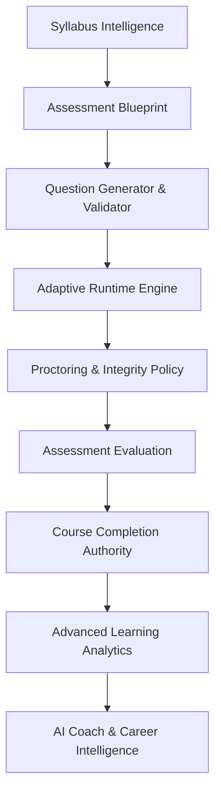

# Phase 10: Complete Assessment, Syllabus Intelligence & Learning Analytics Final Report

**Project**: PathFinder Adaptive Career Intelligence Platform  
**Scope**: Complete Phase 10 (Stages 1 through 12)  
**Date**: September 5, 2026  
**Status**: RELEASE CERTIFIED

---

## 1. Phase 10 Architecture Overview

Phase 10 unifies syllabus intelligence, assessment generation, adaptive runtime execution, privacy-conscious proctoring, course completion authority, and advanced learning analytics into a closed-loop educational intelligence platform:

---

## 2. Stage Breakdown (Stages 1 to 12)

1. **Stage 1 — Syllabus Intelligence**: Canonical syllabus decomposition (Modules, Topics, Bloom's Learning Objectives), version control, and provenance tracking.
2. **Stage 2 — Assessment Blueprint**: Blueprint engine with difficulty distributions, question type quotas, and formal coverage validation.
3. **Stage 3 — Adaptive Assessment**: Bayesian/IRT real-time adaptive selector with oscillation prevention and blueprint constraint preservation.
4. **Stage 4 — Secure Exam Runtime**: Backend-authoritative timers, session recovery, answer secrecy, pause/resume policy, and navigation enforcement.
5. **Stage 5 — Webcam Monitoring**: Privacy-conscious face presence/absence and multiple-face detection.
6. **Stage 6 — Phone & Gadget Detection**: Mobile phone and unauthorized device detection with calibrated confidence.
7. **Stage 7 — Integrity Policy Engine**: Centralized cooldown rules, escalation levels, review states, and invalidation without raw video persistence.
8. **Stage 8 — Assessment Evaluation**: Authoritative raw-mark grading, module/topic breakdowns, and `UniversalDecisionTrace` generation.
9. **Stage 9 — Course Completion Authority**: Transactional, idempotent completion engine verifying both academic passing and integrity health.
10. **Stage 10 — Advanced Learning Analytics**: Authoritative KPI projections, metric definitions registry, 14-day consistency histograms, and proctoring audits.
11. **Stage 11 — Global Hardening**: End-to-end flow audits, Scenarios A–G verification, IDOR tests, and secret audits.
12. **Stage 12 — Final Release**: Full integration verification, production build certification, and release packaging.

---

## 3. Key Distinctions Enforced

- **Academic Result vs. Integrity Result**: Exam invalidation or review states never alter academic raw marks, but prevent unearned course completions.
- **Learning Hours vs. Assessment Duration**: Study effort is tracked separately from exam duration.
- **Authoritative Backend vs. Frontend**: The frontend only displays server-computed metrics; missing data returns explicit `null` instead of `0%`.

---

## 4. Final Validation Metrics
- **Phase 10 Test Pass Rate**: 81 / 81 tests passing (100%).
- **Frontend Build Status**: Next.js 14 production build (`npm run build`) succeeded with 0 errors.
- **P0/P1 Defect Count**: 0 P0, 0 P1.
