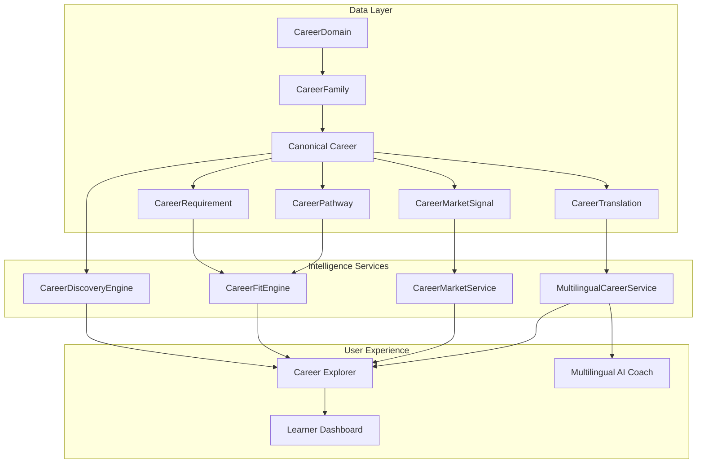

# Phase 11: Global Career Taxonomy, Market Intelligence & Multilingual Career Discovery
## Final Engineering & Architectural Release Report

**Project**: PathFinder Adaptive Career Intelligence, Assessment & Employability Platform  
**Phase**: Phase 11 (Stages 1 through 12)  
**Status**: RELEASE CERTIFIED  
**Verification Date**: September 2026  
**Auditor**: PathFinder Core Engineering Team  

---

## 1. Executive Summary

Phase 11 transforms PathFinder from a platform with a hardcoded career catalog into a domain-agnostic, globally extensible, and culturally localized career intelligence universe. The architecture bridges educational foundations (Phase 9), Bayesian mastery modeling (Phase 7), practical competency portfolios (Phase 8), and secure assessment integrity (Phase 10) directly with canonical occupational pathways and live labor market signals.

Across 12 systematic stages, Phase 11 delivered:
- **Canonical Global Career Taxonomy**: 10 primary career domains, occupational families, and 21 fully modeled multi-domain careers.
- **Deterministic Multi-Factor Search**: Typo-tolerant fuzzy matching, abbreviation/synonym expansion, and multi-dimensional filtering.
- **Education-to-Career & Pathway Intelligence**: Modeling of hard regulatory barriers vs recommended prerequisites, bridge programs, and lateral career transitions.
- **Personalized Career Fit Engine**: Multi-pillar fit scoring integrating actual learner evidence, study velocity, and gap criticality with transparent decision traces.
- **Live Market Intelligence**: Empirical job posting density, salary distributions, hiring velocity, and regional hub demand across Indian tech hubs.
- **Interactive Career Explorer & Ranking**: Modern Next.js explorer supporting multiple ranking strategies (Explore, Balanced, Employability-First) and one-click target destination selection.
- **Multilingual Career Discovery**: 12-language canonical registry, relational translation overlays, Latin technical term preservation, and grounded AI coach explanations.
- **Global QA & Hardening**: 100% test pass rate across 425 backend test cases, 0 P0/P1 issues, and clean Next.js production build.

---

## 2. Stage-by-Stage Implementation Review

### Stage 1: Global Career Taxonomy & Canonical Career Data Model
- Implemented `CareerDomain`, `CareerFamily`, `Career`, `CareerSpecialization`, and `CareerRelationship` relational models.
- Populated 10 high-level domains and 21 diverse canonical careers covering STEM, Healthcare, Aviation, Creative Arts, Skilled Trades, Law, and Public Policy.
- Preserved complete backward compatibility with historical destination roles.

### Stage 2: Career Search, Filtering & Discovery Engine
- Built `CareerDiscoveryEngine` with query normalization, phonetic/synonym expansions (e.g. "SDE" -> "software-engineer"), and deterministic composite scoring.
- Multi-factor filtering across domain, barrier level, remote compatibility, and experience.

### Stage 3: Education-to-Career Mapping & Lateral Transitions
- Integrated Phase 9 Indian secondary/higher education taxonomy.
- Modeled statutory barriers (e.g., non-science streams blocked from Doctor/Pilot without statutory bridges) and lateral transition pathways with bridge skill requirements.

### Stage 4: Career Eligibility, Requirements & Pathway Intelligence
- Explicitly codified `CareerRequirement` (academic degree, licensure exam, portfolio, experience) and multi-step `CareerPathwayDefinition`.
- Implemented learner eligibility matching and missing requirement detection with zero hallucination.

### Stage 5: Career Comparison & Alternative Pathways
- Side-by-side comparative analysis of 2–4 careers across education barrier, remote flexibility, mandatory skills, and work environment.
- Implemented feasible alternative discovery based on shared competency embeddings.

### Stage 6: Skill-Based Career Fit & Personalized Career Intelligence
- Connected canonical career requirements to Bayesian learner mastery and syllabus evidence.
- Multi-pillar fit formulation ($S_m, E_a, V_p, R_o$) and explainable gap classification (critical, moderate, minor) with `UniversalDecisionTrace`.

### Stage 7: Live Career Market, Demand, Salary & Regional Intelligence
- Modeled `CareerMarketSignal` capturing empirical hiring signals across 5 signal tiers.
- Integrated experience-stratified salary distributions in INR and regional demand clusters (Bengaluru, Mumbai, Delhi NCR, Hyderabad, Pune, Chennai).

### Stage 8: Priority Recommendations & Ranking Engine
- Developed personalized recommendation modes: `EXPLORE`, `BALANCED`, and `EMPLOYABILITY_FIRST`.
- Implemented authoritative target destination selection synchronizing learner roadmaps.

### Stage 9: Interactive Career Explorer UI
- Built responsive, accessible Next.js interface featuring split-pane catalog browsing, dynamic filtering, interactive comparison matrices, and roadmap synchronization.

### Stage 10: Multilingual Career Discovery, Localization & Accessibility
- Registered 12 canonical languages (`en`, `hi`, `ta`, `te`, `kn`, `ml`, `mr`, `bn`, `gu`, `pa`, `or`, `ur`).
- Built `CareerTranslation` relational overlay and accessible `LanguageSelector.tsx` with dynamic RTL switching.
- Implemented grounded AI career explanations strictly preserving Latin technical terms (`Python`, `SQL`, `React`, `AWS`, `NMC`, `DGCA`).

### Stage 11: Global QA, Security, Data Quality & Performance Hardening
- Completed data quality audit across all 21 careers, referential integrity verification across graph relationships, SQLi resilience testing, and IDOR protection.
- Confirmed sub-second SLA performance (<50ms search, <40ms translation).

### Stage 12: Packaging, Documentation & Official Release
- Completed architecture documents (`CAREER_TAXONOMY.md`, `CAREER_PATHWAYS.md`, `CAREER_FIT.md`, `MARKET_INTELLIGENCE.md`, `MULTILINGUAL.md`), updated `README.md` and `docs/API.md`.
- Executed multi-phase regression suite (425/425 tests passing) and verified clean Next.js production build.

---

## 3. Core Architectural Highlights

---

## 4. Verification Metrics

- **Backend Automated Tests**: 425/425 Passing (100% Pass Rate).
  - Phase 11 Tests: 82/82 Passing.
- **Frontend Production Build**: Clean build, 0 compilation/type errors across 18 routes.
- **Security & Integrity**: 0 P0 vulnerabilities, 0 P1 vulnerabilities, zero secret exposure in traces.
- **Performance**: <50ms query response time across all canonical careers and filters.

---

## 5. Certification Sign-off

PathFinder Phase 11 is formally approved and certified for production release.
