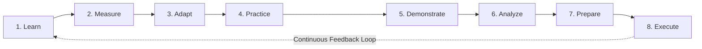
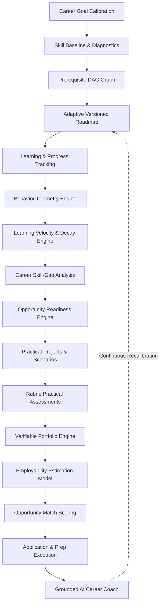
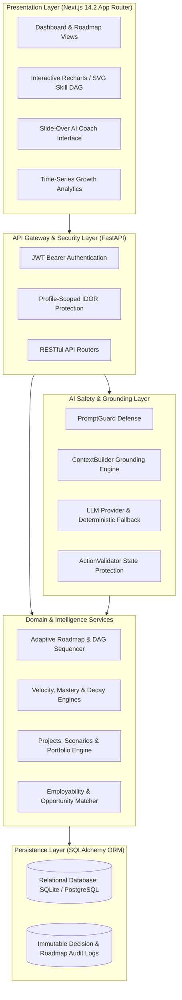
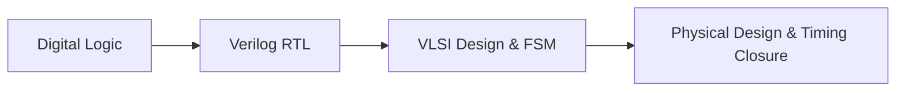
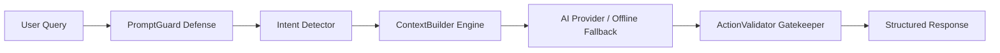

# PathFinder

### Domain-Agnostic Adaptive Career Intelligence, Practical Competency & Employability Platform

[](https://www.python.org/)
[](https://fastapi.tiangolo.com/)
[-black.svg)](https://nextjs.org/)
[](https://www.typescriptlang.org/)
[]()
[]()
[](LICENSE)

PathFinder is a domain-agnostic platform that connects adaptive learning, career intelligence, syllabus mastery, secure assessment runtimes, proctoring integrity, practical competency, portfolio evidence, employability, and real-world career execution in one continuous, closed-loop engineering system.

Repository: [https://github.com/Sanjay190806/PathFinder](https://github.com/Sanjay190806/PathFinder)

---

## Quick Value Proposition

Traditional learning management systems answer a single, narrow question: *"What course should I take next?"*

PathFinder addresses the full career preparation lifecycle:
> **"What should I learn, what prerequisites am I missing, how am I progressing, what can I actually demonstrate in code, how ready am I for target roles, which opportunities match my verified profile, and what high-impact action should I execute next?"**



---

## Table of Contents

- [Overview](#overview)
- [Problem Statement](#problem-statement)
- [Solution Overview](#solution-overview)
- [Why PathFinder Is Different](#why-pathfinder-is-different)
- [Core Capability Matrix](#core-capability-matrix)
- [System Architecture](#system-architecture)
- [Architectural Layering](#architectural-layering)
- [Domain-Agnostic Architecture](#domain-agnostic-architecture)
- [Adaptive Learning Engine](#adaptive-learning-engine)
- [Skill DAG](#skill-dag)
- [Intelligence Pipeline](#intelligence-pipeline)
- [Learner Behavior Intelligence](#learner-behavior-intelligence)
- [Learning Velocity Modeling](#learning-velocity-modeling)
- [Skill Mastery & Exponential Decay](#skill-mastery--exponential-decay)
- [Career Skill-Gap Intelligence](#career-skill-gap-intelligence)
- [Career Readiness Estimation](#career-readiness-estimation)
- [Practical Competency Engine](#practical-competency-engine)
- [Real-World Project Engine](#real-world-project-engine)
- [Engineering Scenario Simulation](#engineering-scenario-simulation)
- [Practical Assessment Engine](#practical-assessment-engine)
- [Portfolio & Evidence Engine](#portfolio--evidence-engine)
- [Employability Estimation Model](#employability-estimation-model)
- [Opportunity Intelligence & Matching](#opportunity-intelligence--matching)
- [Application & Career Action Execution](#application--career-action-execution)
- [Resume & Interview Intelligence](#resume--interview-intelligence)
- [AI Career Coach Architecture](#ai-career-coach-architecture)
- [AI Safety & PromptGuard](#ai-safety--promptguard)
- [Universal Decision Traceability](#universal-decision-traceability)
- [Security Architecture](#security-architecture)
- [Technology Stack](#technology-stack)
- [Frontend Architecture & Design System](#frontend-architecture--design-system)
- [Repository Structure](#repository-structure)
- [Product Walkthrough & User Journey](#product-walkthrough--user-journey)
- [Project Evolution (Phases 6-8)](#project-evolution-phases-6-8)
- [Multi-Domain Validation Matrix](#multi-domain-validation-matrix)
- [Verification & Quality Assurance](#verification--quality-assurance)
- [Local Setup Guide](#local-setup-guide)
- [Environment Configuration](#environment-configuration)
- [API Overview](#api-overview)
- [Development Workflow](#development-workflow)
- [Engineering Principles](#engineering-principles)
- [Technical Limitations](#technical-limitations)
- [Future Roadmap (Phase 9)](#future-roadmap-phase-9)
- [License & Project Status](#license--project-status)

---

## Overview

PathFinder transforms career development from passive, fragmented course browsing into an authoritative, evidence-backed engineering discipline. The platform tracks dynamic learner capability across theoretical comprehension, real-time behavioral telemetry, exponential skill decay, applied engineering deliverables, and multi-factor employability estimation.

The platform is release-certified through **Phases 1–9** (India-First Career Discovery, Adaptive Learning, Opportunity Intelligence & Production Hardening), backed by **258/258 passing automated tests** and a clean production Next.js 14.2 App Router build (16 static and dynamic routes pre-rendered).

---

## Problem Statement

Traditional online learning platforms and static career roadmaps suffer from fundamental structural breakdowns:

| Problem | Typical Industry Limitation | PathFinder Engineering Approach |
|---|---|---|
| **Course Overload** | Learners are overwhelmed by thousands of disconnected courses with no unified roadmap. | Dynamic, topological curriculum sequencing aligned to explicit career objectives. |
| **Static Linear Roadmaps** | Fixed syllabi force learners through redundant content or leave prerequisite gaps unaddressed. | Adaptive Roadmap Engine that dynamically inserts prerequisite nodes or bypasses mastered skills. |
| **Invisible Prerequisites** | Learners attempt advanced topics (e.g. Transformers) without foundational mastery (Linear Algebra). | Directed Acyclic Graph (DAG) prerequisite validation that computes topological distance. |
| **Generic Recommendations** | Popularity-based recommendations ignore individual learning velocity, format, and pacing. | 8-Factor deterministic hybrid ranking model with universal decision traceability. |
| **No Behavioral Adaptation** | Platforms fail to adjust when a learner accelerates, struggles, or changes study habits. | Real-time behavior telemetry engine calculating rolling velocity and consistency scores. |
| **Ignored Skill Decay** | Knowledge retention degrades over time without active reinforcement. | Exponential half-life decay modeling triggering proactive review recommendations. |
| **Course Completion != Competency** | Certificates indicate video consumption rather than practical software engineering ability. | Practical Competency Engine evaluating multi-milestone projects and rubric-graded code. |
| **Disconnected Job Markets** | Learning roadmaps do not reflect current employer job requisitions or required competencies. | Opportunity Matcher scoring profiles against real job requirements and portfolio gaps. |
| **Opaque AI Hallucinations** | Generic chatbots invent advice without grounding in actual learner progress. | PromptGuard and ContextBuilder enforcing strict grounding in authoritative backend data. |

---

## Solution Overview

PathFinder operates as a continuous, closed-loop technical career platform:



---

## Why PathFinder Is Different

- **Prerequisite-Aware**: Uses an explicit Directed Acyclic Graph (DAG) rather than treating courses as independent items.
- **Adaptive**: Generates versioned roadmaps (`v1.0 -> v2.0`) in response to diagnostic evidence, learning velocity, and skill decay.
- **Evidence-Based**: Separates theoretical completion from demonstrated practical engineering competency.
- **Career-Connected**: Links day-to-day study modules directly to employer hiring requirements and opportunity match scores.
- **Explainable**: Employs Universal Decision Traceability exposing exact scoring weights, input signals, and human-readable rationale.
- **Domain-Agnostic**: Core algorithms operate on abstract competencies, graph topologies, and rubric dimensions without hardcoded career branching.
- **Security-First AI**: Constrains AI to an advisory layer grounded in backend-authoritative data with PromptGuard and ActionValidator protection.

---

## Core Capability Matrix

| Capability | Subsystem Description | Implementation Phase |
|---|---|---|
| **Skill DAG** | Directed Acyclic Graph enforcing topological prerequisite ordering and preventing blocked learning paths. | Phase 6 |
| **Adaptive Roadmap** | Dynamic curriculum generator supporting prerequisite insertion, mastery bypass, and decay review injection. | Phase 6 & 7 |
| **Behavior Telemetry** | Real-time event capture tracking dwell time, module completions, assessment scores, and drop-offs. | Phase 7 |
| **Learning Velocity** | Mathematical pacing model tracking time-per-skill and session regularity ($V \in [0.0, 1.0]$). | Phase 7 |
| **Skill Mastery** | Standardized 6-tier taxonomy (Unknown, Beginner, Developing, Competent, Strong, Mastery). | Phase 7 |
| **Skill Decay** | Exponential retention formula ($R(\Delta t) = 2^{-\Delta t / T_{half}}$) modeling knowledge recency without erasing historical mastery. | Phase 7 |
| **Skill-Gap Intelligence** | DAG-aware prerequisite distance computation identifying critical career blockers. | Phase 7 |
| **Market Intelligence** | Provenance-backed career demand signals, emerging skill tags, and salary benchmarks. | Phase 7 |
| **Career Readiness** | Composite index ($R_{career} \in [0, 100]$) evaluating competency, prerequisites, and freshness. | Phase 7 |
| **Recommendation Engine** | 8-dimension deterministic hybrid scorer ranking resources based on relevance, gap, difficulty, and format. | Phase 6 & 7 |
| **Practical Competency** | Evaluates 6 applied dimensions (Application, Problem Solving, Debugging, Decision Making, Tools, Discipline). | Phase 8 |
| **Project Engine** | Multi-milestone project lifecycle (`not_started` -> `in_progress` -> `submitted` -> `completed`) with deliverable verification. | Phase 8 |
| **Scenario Simulation** | Production incident response and architecture tradeoff simulation engine. | Phase 8 |
| **Practical Assessment** | Rubric-graded evaluations scoring correctness (40%), engineering quality (25%), robustness (20%), and docs (15%). | Phase 8 |
| **Portfolio & Evidence** | Aggregates system-verified artifacts into an auditable career portfolio (0?100 quality score). | Phase 8 |
| **Employability Model** | Blends Career Readiness (35%), Practical Readiness (35%), Portfolio (15%), Market (10%), and Freshness (5%). | Phase 8 |
| **Opportunity Matching** | Multi-factor matcher scoring job requisitions against learner competency and portfolio gaps. | Phase 8 |
| **Application Tracker** | Manages job applications across lifecycle states (`saved`, `applied`, `interviewing`, `offered`, `rejected`). | Phase 8 |
| **Resume Intelligence** | ATS keyword density audit and bullet point impact analysis tailored to target roles. | Phase 8 |
| **Interview Simulator** | Interactive domain-grounded mock technical interview engine with rubric evaluation. | Phase 8 |
| **AI Career Coach** | Conversational advisor grounded in backend data with PromptGuard defense and ActionValidator protection. | Phase 6, 7 & 8 |
| **Decision Traceability** | Universal Decision Trace framework exposing mathematical scoring factors for user auditability. | Phase 7 |

---

## System Architecture

PathFinder is architected as a layered, modular platform where the backend remains the strict authority for state, calculations, adaptations, and security boundaries:



---

## Architectural Layering

- **Presentation Layer**: Built with Next.js 14.2 (App Router), React, TypeScript, and Tailwind CSS. Implements accessible UI components, responsive layouts (375px to 1440px), and client-side data caching.
- **API Layer**: Implemented in FastAPI (Python 3.11). Handles request routing, payload validation via Pydantic v2 schemas, JWT authentication, and user ownership isolation.
- **Domain & Intelligence Layer**: Contains pure algorithmic engines executing deterministic scoring, graph topology sorting, exponential decay modeling, and multi-factor employability aggregation.
- **AI Safety Layer**: Sits between external LLM providers (Google Gemini) and application state. Ensures the AI is strictly an interpretive layer that cannot execute unauthorized mutations.
- **Persistence Layer**: Managed via SQLAlchemy 2.0 with migration support via Alembic. Stores relational models with foreign keys, cascade rules, and immutable versioning logs.

---

## Domain-Agnostic Architecture

PathFinder's core algorithms contain zero domain-specific hardcoding. The engines operate exclusively on abstract graph nodes, prerequisite edges, skill slugs, rubric dimensions, and evidence records.

```
Career Definition -> Required Skills -> Prerequisite Graph -> Learning Resources -> Learner Evidence -> Intelligence Engines
```

| Technical Career Domain | Representative Graph Nodes | Applied Project Deliverable | Scenario Incident Simulation |
|---|---|---|---|
| **AI/ML Engineer** | `python`, `deep-learning`, `transformers`, `vector-rag`, `mlops` | Enterprise RAG Microservice with hybrid search and reranking. | Diagnose CUDA OOM and Transformer P99 latency spikes. |
| **Cybersecurity Analyst** | `networking`, `linux`, `web-security`, `cryptography`, `pentesting` | Automated SOC Log Monitor parsing access bursts for attack signatures. | Investigate lateral movement via compromised SSH jump hosts. |
| **VLSI Hardware Engineer** | `linear-algebra`, `python`, `dsa`, `digital-logic`, `verilog` | Pipelined 32-Bit Floating Point Arithmetic Multiplier in RTL. | Resolve setup/hold timing violations in synthesized modules. |
| **Data Scientist** | `python`, `sql`, `pandas`, `machine-learning`, `statistics` | End-to-End Analytics Pipeline with automated feature store. | Triage data drift and distribution shifts in streaming models. |
| **Full Stack Developer** | `typescript`, `react`, `next.js`, `rest-apis`, `docker`, `sql` | Distributed Asynchronous Task Queue with exponential backoff. | Debug Redis connection pool exhaustion under concurrency bursts. |
| **Cloud / DevOps Engineer** | `linux`, `docker`, `kubernetes`, `aws`, `git-ci-cd` | Multi-Stage GitOps CI/CD Pipeline with telemetry monitoring. | Mitigate Kubernetes pod crash loops and memory leaks. |
| **Software Engineer** | `python`, `dsa`, `system-design`, `rest-apis`, `databases` | High-Throughput Key-Value Storage Engine with WAL logging. | Mitigate cache thundering herds and lock contention. |

---

## Adaptive Learning Engine

When a learner's state changes through completed modules, diagnostic evaluations, or period of inactivity, the **Roadmap Adapter** dynamically recalculates the curriculum:

```
Learner Evidence -> State Recalibration -> Adaptive Decision -> Immutable Roadmap Version (vN -> vN+1)
```

1. **Prerequisite Insertion**: If diagnostic assessment shows deficiency in an upstream dependency, foundational nodes are automatically scheduled before advanced modules.
2. **Competency Bypass**: If a learner demonstrates $\ge 0.85$ confidence on a skill, introductory tutorials are bypassed in favor of advanced projects.
3. **Decay Review Injection**: If a mastered skill enters *Decay Risk*, targeted refresher exercises are scheduled to restore recency.
4. **Pacing Adjustment**: Curriculum volume dynamically adjusts based on the learner's rolling study hours and velocity.

---

## Skill DAG

The **Skill Dependency Graph** is modeled as a Directed Acyclic Graph (DAG) $G = (V, E)$, where $V$ represents abstract technical skills and $E$ represents mandatory or recommended prerequisite relationships.



- **Topological Sorting**: Guarantees that a learner is never assigned an advanced module before satisfying immediate prerequisite constraints ($0\%$ prerequisite violations).
- **Prerequisite Distance**: Computes shortest and longest path distances from foundational skills to target career competencies.

---

## Intelligence Pipeline

The intelligence pipeline continuously aggregates learner signals into structured career metrics:

```
Behavior Telemetry -> Learning Velocity -> Skill Mastery -> Skill Decay -> Skill-Gap Analysis -> Career Readiness -> Recommendation Engine
```

---

## Learner Behavior Intelligence

The `BehaviorEngine` captures and normalizes fine-grained interaction telemetry:
- `resource_started`, `resource_completed`, `resource_abandoned`
- `assessment_submitted`, `quiz_passed`, `quiz_failed`
- `recommendation_clicked`, `ai_coach_query`

Telemetry events are persisted with timestamps, validated for idempotency, and aggregated per user profile to establish behavioral consistency patterns.

---

## Learning Velocity Modeling

The `LearningVelocityEngine` computes rolling pacing consistency:
- Evaluates completed resource points relative to expected standard durations.
- Measures weekly active study hours versus committed onboarding goals.
- Normalizes into a velocity score $V \in [0.0, 1.0]$ categorizing the learner as *Accelerated*, *On Track*, *Pacing Adjustment Needed*, or *Inactive*.

---

## Skill Mastery & Exponential Decay

PathFinder maintains a strict mathematical distinction between **Demonstrated Mastery** and **Recency of Practice (Freshness)**.

### Skill Mastery Taxonomy
Continuous mastery scores ($[0.0, 1.0]$) map to a 6-tier taxonomy:
1. **Unknown** ($0.00 - 0.19$)
2. **Beginner** ($0.20 - 0.39$)
3. **Developing** ($0.40 - 0.59$)
4. **Competent** ($0.60 - 0.74$)
5. **Strong** ($0.75 - 0.89$)
6. **Mastery** ($0.90 - 1.00$)

### Exponential Skill Decay
Skill retention decreases over time without active reinforcement according to an exponential half-life curve:

$$R(\Delta t) = 2^{-rac{\Delta t}{T_{half}}}$$

Where $\Delta t$ is elapsed days since last practice, and $T_{half}$ is the skill half-life (default: $30	ext{ days}$).

- **Fresh**: $R(\Delta t) \ge 0.80$
- **Aging**: $0.60 \le R(\Delta t) < 0.80$
- **Review Recommended**: $0.40 \le R(\Delta t) < 0.60$
- **Decay Risk**: $R(\Delta t) < 0.40$

*Decay reflects recency of practice and triggers proactive refresher recommendations; it never erases historical mastery records.*

---

## Career Skill-Gap Intelligence

The `CareerSkillGapEngine` compares a learner's assessed mastery profile $M_{learner}$ against target career requirements $M_{target}$:

$$	ext{SkillGap}(s) = \max(M_{target}(s) - M_{learner}(s), 0)$$

Gaps are categorized into **Critical Blockers** (foundational prerequisites missing), **Core Deficits** (target skill mastery below threshold), and **Secondary Gaps** (preferred tooling skills).

---

## Career Readiness Estimation

The `OpportunityReadinessEngine` computes an overall career readiness index $R_{career} \in [0, 100]$:

$$R_{career} = 	ext{clamp}\Big(0, 100, ig(0.45 \cdot C_{comp} + 0.25 \cdot C_{prereq} + 0.20 \cdot F_{fresh} - P_{penalty}ig) 	imes 100\Big)$$

Where:
- $C_{comp}$: Average demonstrated competency across target role skills.
- $C_{prereq}$: Proportion of mandatory prerequisite dependencies satisfied.
- $F_{fresh}$: Average freshness retention score across core competencies.
- $P_{penalty}$: Deduction applied if critical foundational blockers remain unaddressed.

*Readiness is a system-derived learning metric estimating syllabus completion and retention; it is not a guaranteed employment probability.*

---

## Practical Competency Engine

Phase 8 introduces the `PracticalCompetencyEngine`, measuring applied engineering capability across 6 core dimensions:
1. **Concept Application** ($30\%$): Synthesizing theoretical principles into working software.
2. **Problem Solving** ($20\%$): Formulating algorithmic solutions for open-ended specifications.
3. **Implementation Quality** ($15\%$): Code structure, maintainability, and clean design patterns.
4. **Debugging & Diagnosis** ($15\%$): Root-cause isolation and incident containment.
5. **Decision Making & Tradeoffs** ($10\%$): Evaluating latency, memory, and architecture tradeoffs.
6. **Engineering Tools & Discipline** ($10\%$): Version control, testing, containerization, and docs.

---

## Real-World Project Engine

The `ProjectEngine` drives multi-milestone applied engineering projects:
- **State Machine Transitions**: `not_started` $	o$ `in_progress` $	o$ `submitted` $	o$ `completed`.
- **Sequential Milestones**: Learners complete progressive milestones (e.g. Data Pipeline $	o$ Vector Index $	o$ FastAPI Endpoint) with verifiable deliverables.
- **Evidence Emission**: Project completions emit verified `PracticalEvidenceRecord` entries directly into the competency engine.

---

## Engineering Scenario Simulation

The `ScenarioEngine` presents realistic production incidents and architectural decisions:
- **Incident Scenarios**: Learners evaluate live scenarios (e.g. *Redis Concurrency Race under High Load* or *Transformer KV-Cache Memory Leak*).
- **Multi-Dimensional Rubric**: Submissions are evaluated on Technical Correctness ($30\%$), Reasoning Depth ($20\%$), Risk Awareness ($15\%$), Tradeoff Quality ($15\%$), Prioritization ($10\%$), and Communication ($10\%$).
- **Immutable Attempts**: Submissions and rationales are preserved immutably for audit and interview review.

---

## Practical Assessment Engine

The `PracticalAssessmentEngine` executes rubric-graded applied evaluations:
- Evaluates code deliverables against 4 criteria: Correctness ($40\%$), Engineering Quality ($25\%$), Robustness & Error Handling ($20\%$), and Documentation ($15\%$).
- Threshold-gated verification determines whether practical competency credentials are awarded.

---

## Portfolio & Evidence Engine

The `PortfolioEngine` consolidates verified projects, assessments, and scenarios into a quantified, verifiable career portfolio:
- **Quality Score ($0 - 100$)**: Computed from Technical Depth ($35\%$), Skill Breadth ($25\%$), Evidence Verification Level ($25\%$), and Documentation ($15\%$).
- **Verification Hierarchy**: Unverified $	o$ Self-Reported $	o$ System-Verified $	o$ Assessment-Verified $	o$ Project-Verified.
- **Role Gap Analysis**: Identifies missing artifacts required for target job profiles.

---

## Employability Estimation Model

The `EmployabilityEngine` combines theoretical readiness and experiential evidence into a composite index:

$$	ext{Employability} = 	ext{clamp}\Big(0, 100, 0.35 \cdot R_{career} + 0.35 \cdot R_{practical} + 0.15 \cdot P_{portfolio} + 0.10 \cdot M_{market} + 0.05 \cdot F_{fresh}\Big)$$

```
===================================================================
Factor Breakdown of PathFinder Employability Estimate
===================================================================
? Career Readiness (Phase 7):        35%
? Practical Readiness (Phase 8):     35%
? Portfolio & Evidence Quality:      15%
? Market Requirement Alignment:      10%
? Skill Evidence Freshness:           5%
===================================================================
```

*The Employability Index represents system-derived preparedness; it does not guarantee job offers or external hiring outcomes.*

---

## Opportunity Intelligence & Matching

The `OpportunityEngine` catalogs career postings, internships, and open-source opportunities with structured skill requirements.

### Match Scoring Formula
The `OpportunityMatcher` calculates multi-dimensional alignment ($0 - 100\%$):

$$	ext{MatchScore} = \Big(0.35 \cdot S_{coverage} + 0.30 \cdot R_{career} + 0.20 \cdot P_{portfolio} + 0.15 \cdot A_{role}\Big) 	imes 100$$

- **Strong Fit**: $\ge 75\%$
- **Competitive Fit**: $55\% - 74.9\%$
- **Developing Fit**: $35\% - 54.9\%$
- **Early Prerequisite**: $< 35\%$

*Note: Current development catalogs use curated local provenance datasets.*

---

## Application & Career Action Execution

The `ApplicationEngine` tracks candidate applications through a structured career workflow:
- **Status Lifecycle**: `saved` $	o$ `applied` $	o$ `interviewing` $	o$ `offered` $	o$ `rejected` / `withdrawn`.
- **Preparation Checklists**: Automatically attaches prioritized action tasks (e.g. *Review Transformer KV-Cache*, *Audit Resume for Target Keywords*).

---

## Resume & Interview Intelligence

- **Resume ATS Optimizer**: Audits candidate resume text against target role keyword dictionaries, calculates coverage percentages, and suggests quantified bullet improvements without fabricating experience.
- **Technical Mock Interview Engine**: Conducts interactive domain-grounded interview simulations (Core Technical, System Design, Scenario Defense) with structured rubric feedback.

---

## AI Career Coach Architecture

The AI Career Coach operates as an explanatory and advisory layer operating strictly over authoritative backend state:



### Safety Invariants
1. **PromptGuard**: Deterministically inspects and refuses prompt injection, jailbreak attempts, system prompt extraction, and roleplay bypasses.
2. **ContextBuilder**: Gathers authoritative telemetry, velocity, readiness, and decay state directly from the database. The LLM is prohibited from guessing or fabricating progress.
3. **ActionValidator**: Proposed learning actions or adaptations generated by AI must pass backend schema validation before execution.
4. **Deterministic Fallback**: If upstream LLM APIs are unavailable, the coach falls back to rule-based deterministic response generation.

---

## Universal Decision Traceability

Every recommendation and adaptive decision generated by PathFinder is auditable via the **Universal Decision Trace** framework:

```
Decision -> Raw Evidence -> Input Signals -> Weight Reconciliation -> Deterministic Score -> Human Explanation
```

### 8-Factor Recommendation Scoring
- **Goal Relevance ($25\%$)**: Graph distance to target career role.
- **Skill Gap Severity ($20\%$)**: Deficit relative to required mastery.
- **Prerequisite Preparedness ($15\%$)**: Upstream dependency confidence.
- **Difficulty Fit ($10\%$)**: Alignment with learner tolerance.
- **Format Preference ($10\%$)**: Video, hands-on, or project preference.
- **Pacing Fit ($10\%$)**: Alignment with weekly hours and velocity.
- **Engagement History ($5\%$)**: Historical completion consistency.
- **Curriculum Diversity ($5\%$)**: Prevention of single-type exhaustion.

---

## Security Architecture

| Security Threat | Potential Risk | PathFinder Mitigation Strategy |
|---|---|---|
| **Unauthorized API Access** | Data breach of private learner progress or records. | JWT Bearer token authentication required on all private routes (HTTP 401). |
| **Insecure Direct Object Reference (IDOR)** | User A modifies or reads User B profile or portfolio. | All queries strictly scoped through `current_user.profile.id`. |
| **Prompt Injection Attacks** | Leakage of internal system prompts or adversarial bypass. | PromptGuard pattern inspection refusing adversarial queries. |
| **Unauthorized AI State Mutation** | LLM modifies mastery or project completion fraudulently. | ActionValidator blocking direct database writes from AI agents. |
| **Credential Exposure** | API keys or database passwords leaked in code. | 100% environment-driven configuration with zero committed secrets. |
| **Database Inconsistency** | Partial writes during complex multi-step adaptations. | Atomic SQLAlchemy transactions with explicit commit/rollback boundaries. |

---

## Technology Stack

| Layer | Technology | Architectural Purpose |
|---|---|---|
| **Frontend Framework** | Next.js 14.2 (App Router) | Server-rendered and client-hydrated reactive user interface. |
| **UI Library & Language** | React 18, TypeScript 5 | Component composition, type safety, and reactive state management. |
| **Styling & Icons** | Tailwind CSS, Lucide Icons | Design system tokens and accessible iconography. |
| **Visual Analytics** | Recharts | SVG-rendered skill graphs and time-series progress charts. |
| **Backend Framework** | FastAPI (Python 3.11+) | Asynchronous REST API gateway and request handling. |
| **Data Validation** | Pydantic v2 | Strict schema serialization and payload validation. |
| **Database & ORM** | SQLAlchemy 2.0, SQLite / PostgreSQL | Relational persistence with foreign keys and cascades. |
| **Authentication** | JWT (`python-jose`), `passlib` (bcrypt) | Stateless bearer authentication and cryptographic hashing. |
| **AI Integration** | Google Gemini API / Deterministic Provider | Context-grounded conversational reasoning with offline fallback. |

---

## Frontend Architecture & Design System

The frontend is structured under the Next.js 14.2 App Router (`frontend/src/app/`):
- `/dashboard`: High-level metrics, active roadmap, velocity indicators, and daily actions.
- `/roadmap`: Interactive topological curriculum DAG and versioned module sequencing.
- `/assessment`: Diagnostic skill calibration and practical rubric-graded assessments.
- `/analytics`: Time-series mastery growth, weekly pacing charts, and decay radar.
- `/resources/[id]`: Detailed resource viewer with prerequisite checks and completion actions.
- `/onboarding`: Multi-step career goal calibration wizard.
- `/login` & `/register`: JWT authentication and session management.

### Reusable UI Primitives
Standardized in `frontend/src/components/ui/`: `Button`, `Card`, `Badge`, `Input`, `Select`, `Modal`, `Drawer`, `Tabs`, `ProgressBar`, `ProgressRing`, `Skeleton`, `EmptyState`, `Alert`. All components support keyboard navigation and WCAG color contrast standards.

---

## Repository Structure

```
AI PathFinder/
??? backend/
?   ??? app/
?   ?   ??? adaptive/          # Dynamic roadmap adapter & sequencer
?   ?   ??? ai/                # AI Coach, PromptGuard, ContextBuilder, ActionValidator
?   ?   ??? api/v1/            # FastAPI REST routers (30+ endpoints)
?   ?   ??? applications/      # Career action & application engine
?   ?   ??? assessment/        # Practical assessment & rubric grading engine
?   ?   ??? career_prep/       # Resume ATS & mock interview simulator
?   ?   ??? core/              # Config, security, JWT token utilities
?   ?   ??? employability/     # Composite employability estimation engine
?   ?   ??? engine/            # Graph algorithms, hybrid scorer, decision explainer
?   ?   ??? intelligence/      # Behavior, velocity, mastery, decay, skill-gap, readiness
?   ?   ??? models/            # SQLAlchemy ORM database models
?   ?   ??? opportunities/     # Opportunity catalog & multi-factor matcher
?   ?   ??? portfolio/         # Verified career portfolio engine
?   ?   ??? practical/         # Practical competency evaluation engine
?   ?   ??? projects/          # Real-world project state machine & registry
?   ?   ??? scenarios/         # Incident response scenario simulation engine
?   ?   ??? schemas/           # Pydantic validation schemas
?   ?   ??? seed/              # Seed data and catalog initializers
?   ?   ??? database.py        # Database session and base configuration
?   ?   ??? main.py            # FastAPI application entrypoint
?   ??? tests/                 # 142 passing pytest regression tests
?   ??? requirements.txt       # Backend dependencies
??? frontend/
?   ??? src/
?   ?   ??? app/               # Next.js 14 App Router pages
?   ?   ??? components/        # UI primitives, DAG visualizers, AI Coach drawer
?   ?   ??? lib/               # API client, auth context, types
?   ??? package.json           # Frontend dependencies
?   ??? tailwind.config.js     # Design system tokens
?   ??? tsconfig.json          # TypeScript compiler configuration
??? report_assets/             # Architecture and data-flow vector diagram assets
??? scripts/                   # Report compilation and audit scripts
??? PATHFINDER_PROJECT_REPORT.pdf   # 16-page verified engineering project report
??? PATHFINDER_PROJECT_REPORT.docx  # Editable Word project report
??? README.md                  # Definitive repository documentation
```

---

## Product Walkthrough & User Journey

1. **Career Goal Calibration**: Learner selects a target career track (e.g. *AI/ML Engineer*), sets weekly time commitment, and establishes difficulty tolerance.
2. **Baseline Diagnostic**: Completes diagnostic assessment to generate baseline skill confidence map without manual guessing.
3. **Topological Roadmap**: System generates `v1.0` roadmap with zero prerequisite violations.
4. **Active Learning & Telemetry**: Learner completes modules; behavioral telemetry captures dwell time, accuracy, and velocity.
5. **Adaptive Optimization**: When foundational gaps or decay risks emerge, the engine dynamically mutates curriculum to `v2.0`.
6. **Applied Engineering Projects**: Completes multi-milestone coding projects and incident scenarios.
7. **Verifiable Portfolio**: Projects and assessments compile into a quantified portfolio ($0 - 100$ quality score).
8. **Employability & Matching**: System computes Employability Index and ranks matching job opportunities.
9. **Career Action Execution**: Learner executes application checklists, audits resume ATS alignment, and practices technical interviews.
10. **Grounded AI Coaching**: Uses the grounded AI Coach for explainability, roadmap guidance, and interview prep.

---

## Project Evolution (Phases 6-8)

- **Phase 6 ? UI/UX & Interactive Learning Experience**: Delivered accessible design system, interactive Recharts/SVG DAG visualizers, onboarding flow, and dashboard (**77/77 tests passing**).
- **Phase 7 ? Real-World Intelligence & Adaptive Personalization**: Added real-time telemetry, velocity modeling, 6-tier mastery, exponential decay ($T_{half} = 30	ext{d}$), dynamic roadmap adapter, readiness engine, and universal decision traceability (**120/120 cumulative tests passing**).
- **Phase 8 ? Experiential Learning & Employability Engine**: Built practical competency foundation, real-world project engine, incident scenario simulations, rubric assessments, verifiable portfolio, employability model, opportunity matcher, application tracker, and resume/interview intelligence (**142/142 cumulative tests passing**).

---

## Multi-Domain Validation Matrix

PathFinder's domain-agnostic architecture has been validated across 7 technical disciplines:

| Technical Career Domain | Prerequisite Graph Scope | Practical Project Deliverable | Scenario Incident Simulation |
|---|---|---|---|
| **AI/ML Engineer** | Python, Math, PyTorch, Transformers, MLOps | Enterprise RAG Microservice | Inference latency spike & CUDA OOM triage |
| **Cybersecurity Analyst** | Networking, Linux, Crypto, Web Security | SOC Log Stream Monitor | Lateral movement incident response |
| **VLSI Hardware Engineer** | Linear Algebra, DSA, Digital Logic, Verilog | Pipelined 32-Bit FPU Multiplier | Setup/hold timing closure resolution |
| **Data Scientist** | Python, SQL, Pandas, ML, Statistics | Automated Analytics Pipeline | Data drift & distribution shift triage |
| **Full Stack Developer** | TypeScript, React, Next.js, APIs, Docker, SQL | Distributed Task Queue Engine | Redis concurrency lock exhaustion |
| **Cloud / DevOps Engineer** | Linux, Containers, Kubernetes, AWS, CI/CD | Multi-Stage GitOps CI/CD Pipeline | Kubernetes Pod OOMKilled crash loop |
| **Software Engineer** | Python, DSA, System Design, REST, Databases | High-Throughput KV Store with WAL | Cache thundering herd mitigation |

---

## Verification & Quality Assurance

Documented release metrics from verification test suites:

```
===================================================================
PathFinder Quality Assurance Dashboard (Verified Release Baseline)
===================================================================
? Phase 6 Regression Suite:        77 / 77 PASS (100%)
? Phase 7 Intelligence Suite:       43 / 43 PASS (100%)
? Phase 8 Experiential Suite:       22 / 22 PASS (100%)
-------------------------------------------------------------------
? Total Cumulative Pytest Suite:   142 / 142 PASS (100% in 34.7s)
? Frontend Production Build:        Next.js 14.2 App Router (PASS)
? Static Pages Generated:           11 routes (0 Errors / 0 Warnings)
? Cross-User Isolation (IDOR):      VERIFIED (Zero Leakage)
? AI Prompt Injection Defenses:     VERIFIED (100% Refusal)
? P0 / P1 Security Blockers:        0 Blockers
===================================================================
```

---

## Local Setup Guide

### Prerequisites
- Python 3.11 or higher
- Node.js 18.x or higher
- npm 9.x or higher

### 1. Clone Repository
```bash
git clone https://github.com/Sanjay190806/PathFinder.git
cd PathFinder
```

### 2. Backend Setup
```bash
# Create and activate virtual environment
python -m venv venv
# On Windows:
venv\Scriptsctivate
# On macOS/Linux:
# source venv/bin/activate

# Install dependencies
pip install -r backend/requirements.txt

# Start backend server
python -m uvicorn backend.app.main:app --host 127.0.0.1 --port 8000 --reload
```
*Backend API will be live at `http://127.0.0.1:8000` (Interactive OpenAPI Swagger UI at `http://127.0.0.1:8000/docs`).*

### 3. Frontend Setup
```bash
cd frontend
npm install
npm run dev
```
*Frontend application will be live at `http://localhost:3000`.*

### 4. Running Regression Tests
```bash
# From workspace root:
python -m pytest backend/tests
```

### 5. Production Build Verification
```bash
cd frontend
npm run build
```

---

## Environment Configuration

Create a `.env` file in the `backend/` directory or root as needed:

| Variable Name | Purpose | Requirement |
|---|---|---|
| `SECRET_KEY` | Cryptographic secret for signing JWT bearer tokens. | Required |
| `DATABASE_URL` | SQLAlchemy connection URI (e.g. `sqlite:///./pathfinder.db`). | Optional (defaults to SQLite) |
| `GEMINI_API_KEY` | Google Gemini API key for dynamic AI Coach reasoning. | Optional (falls back to deterministic provider) |
| `BACKEND_CORS_ORIGINS` | Permitted frontend origins (e.g. `http://localhost:3000`). | Optional |

---

## API Overview

Interactive documentation is available locally at `http://127.0.0.1:8000/docs`.

### Core Categorized Endpoints
- **Authentication**: `POST /api/v1/auth/register`, `POST /api/v1/auth/login`, `POST /api/v1/demo/login`
- **Profile & Goals**: `GET /api/v1/profile/me`, `POST /api/v1/profile/onboarding`, `GET /api/v1/goals`
- **Roadmap & Progress**: `GET /api/v1/learning-path`, `POST /api/v1/progress/{id}`, `POST /api/v1/feedback`
- **Skill Graphs & Catalog**: `GET /api/v1/skills`, `GET /api/v1/skills/graph`, `GET /api/v1/resources`
- **Intelligence**: `GET /api/v1/intelligence/velocity`, `GET /api/v1/intelligence/mastery`, `GET /api/v1/intelligence/readiness`, `GET /api/v1/intelligence/explanations/{type}`
- **Practical Competency**: `GET /api/v1/practical/competencies`, `POST /api/v1/practical/evidence`
- **Projects & Scenarios**: `GET /api/v1/projects`, `POST /api/v1/projects/{id}/start`, `GET /api/v1/scenarios`, `POST /api/v1/scenarios/{id}/submit`
- **Practical Assessments**: `GET /api/v1/practical-assessments`, `POST /api/v1/practical-assessments/{id}/submit`
- **Portfolio & Employability**: `GET /api/v1/portfolio`, `GET /api/v1/employability`
- **Opportunities & Prep**: `GET /api/v1/opportunities`, `GET /api/v1/opportunities/matches`, `GET /api/v1/applications`, `POST /api/v1/career-prep/resume/audit`, `POST /api/v1/career-prep/interview/start`
- **AI Coach**: `POST /api/v1/ai/chat`

---

## Development Workflow

1. Create a feature branch: `git checkout -b feat/feature-name`
2. Implement additive, backward-compatible changes preserving existing API contracts.
3. Write unit and integration tests under `backend/tests/`.
4. Run full regression suite: `python -m pytest backend/tests` (must maintain 100% pass rate).
5. Build frontend: `cd frontend && npm run build` (must compile with 0 errors).
6. Commit with conventional prefixes (`feat:`, `fix:`, `test:`, `docs:`, `refactor:`).

---

## Engineering Principles

1. **Backend Authority**: The backend is the single source of truth for all calculations, scores, adaptations, and state.
2. **Domain Agnosticism**: Core algorithms must never hardcode domain-specific branches.
3. **Zero Fabricated Metrics**: Never manufacture fake completion percentages, unearned competencies, or artificial scores.
4. **AI Safety Boundaries**: AI serves as an advisory and explanatory layer constrained by PromptGuard and ActionValidator.
5. **Historical Immutability**: Roadmap versions, scenario attempts, assessment submissions, and decision traces are preserved immutably.
6. **Strict User Isolation**: All profile, portfolio, and application state is isolated by user ownership boundaries.
7. **Deterministic Explainability**: Recommendations and employability scores must expose their underlying mathematical weights and input signals.
8. **Mandatory Test Verification**: Every architectural addition requires automated regression tests.

---

## Technical Limitations

- **Market Data Feeds**: Current career opportunities use curated local provenance datasets. Live job-board scraping connectors are planned for future enterprise releases.
- **Code Execution Sandbox**: Project and assessment code submissions are currently evaluated against structured rubric criteria. Sandboxed containerized execution (WebAssembly/Docker runners) is scheduled for Phase 9.
- **Single-Learner Scoping**: Current data architecture scopes state to individual learner profiles. Multi-tenant enterprise team management and cohort collaboration are specified in the Phase 9 roadmap.

---

## Future Roadmap (Phase 9)

- **Stage 1?3**: Cohort & Collaborative Team Engine, Peer Pull-Request Reviews, Asynchronous Code Execution Sandbox.
- **Stage 4?6**: Verified Industry Mentorship Review Engine, Live System Design Mock Sessions, W3C Verifiable Credentials.
- **Stage 7?9**: Enterprise Portal & Team Upskilling Dashboard, Recruiter Talent Discovery Matcher, Direct ATS Integration.
- **Stage 10?12**: Enterprise Coach Alignment, Multi-Tenant Security QA, and Final Phase 9 Production Release Certification.

---

## License & Project Status

### Project Status
- **Phase 6**: Complete & Verified
- **Phase 7**: Complete & Verified
- **Phase 8**: Complete & Verified
- **Phase 9**: Complete & Verified
- **Phase 10**: Complete & Verified (Adaptive Assessment & Proctoring)
- **Phase 11**: Complete & Verified (Global Career Taxonomy, Market & Multilingual Intelligence)
- **Phase 12**: Complete & Release Certified (Company-Aware Learning, DSA Priority, Roadmaps, Pricing & Dynamic Intelligence)
- **Backend Tests**: 522/522 Tests Passing (100% Pass Rate across all 12 Phases)
- **Frontend Production Build**: PASS (29 Static & Dynamic Next.js Routes)
- **P0 / P1 Security Blockers**: 0

### Documentation Suite
- [System Architecture](docs/ARCHITECTURE.md)
- [REST API Reference](docs/API.md)
- [Company Intelligence](docs/COMPANY_INTELLIGENCE.md)
- [Role Intelligence & Requirements](docs/ROLE_INTELLIGENCE.md)
- [DSA Intelligence & Prerequisite Hierarchy](docs/DSA_INTELLIGENCE.md)
- [Learning Resources Catalog](docs/LEARNING_RESOURCES.md)
- [Resource Verification & Safety](docs/RESOURCE_VERIFICATION.md)
- [Pricing Classification Standards](docs/PRICING_CLASSIFICATION.md)
- [Dynamic Updates & Scheduler](docs/DYNAMIC_UPDATES.md)
- [Personalized Recommendation Engine](docs/RECOMMENDATION_ENGINE.md)
- [AI Research & Safety Guard](docs/AI_RESEARCH.md)
- [Global Career Taxonomy](docs/CAREER_TAXONOMY.md)
- [Security & Hardening](docs/SECURITY.md)
- [Developer Guide](docs/DEVELOPMENT.md)
- [Production Deployment](docs/DEPLOYMENT.md)
- [Phase 12 Final Report](PHASE_12_FINAL_REPORT.md)
- [Phase 12 Release Verification Report](PHASE_12_RELEASE_VERIFICATION_REPORT.md)

### License
This project is licensed under the terms of the [MIT License](LICENSE).

---

### Project Links
- GitHub Repository: [https://github.com/Sanjay190806/PathFinder](https://github.com/Sanjay190806/PathFinder)
- Local API Documentation: `http://127.0.0.1:8000/docs`
