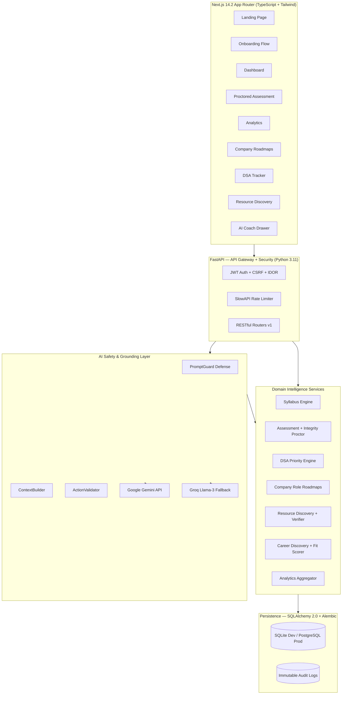

# PathFinder 🧭

<p align="center">
  <strong>AI-Powered Adaptive Career Intelligence & Learning Platform for India</strong>
</p>

<p align="center">
  <a href="https://www.python.org/"></a>
  <a href="https://fastapi.tiangolo.com/"></a>
  <a href="https://nextjs.org/"></a>
  <a href="https://www.typescriptlang.org/"></a>
  <a href="https://www.sqlalchemy.org/"></a>
  <a href="https://ai.google.dev/"></a>
  <a href="LICENSE"></a>
  
</p>

---

PathFinder is a closed-loop, AI-powered career development platform built specifically for Indian students and early-career professionals. It unifies adaptive learning, syllabus intelligence, secure proctored assessments, DSA preparation, company-role roadmaps, skill-gap analysis, and personalized resource recommendations into a single, evidence-backed platform.

> **Repository:** [https://github.com/Sanjay190806/PathFinder](https://github.com/Sanjay190806/PathFinder)

---

## 📌 Table of Contents

- [What PathFinder Does](#what-pathfinder-does)
- [Fully Completed Features](#-fully-completed-features)
- [Technology Stack](#️-technology-stack)
- [System Architecture](#-system-architecture)
- [Repository Structure](#-repository-structure)
- [Local Setup Guide](#-local-setup-guide)
- [Environment Variables](#-environment-variables)
- [API Overview](#-api-overview)
- [Engineering Principles](#️-engineering-principles)
- [License](#-license)

---

## What PathFinder Does

Traditional platforms answer only *"What course should I take next?"* PathFinder answers the complete career preparation lifecycle:

```
Learn → Measure → Adapt → Practice → Demonstrate → Analyze → Prepare → Execute
  └─────────────────── Continuous Feedback Loop ──────────────────────────┘
```

PathFinder connects:
- **Syllabus Intelligence** — curated, India-specific course syllabi with topic-level mastery tracking
- **Adaptive Assessments** — secure, AI-generated, proctored MCQ & scenario exams
- **DSA Priority Engine** — personalized problem selection mapped to target company interview patterns
- **Company Role Roadmaps** — company-specific skill maps (FAANG, Indian MNCs, startups) with gap scoring
- **Resource Discovery** — verified, multi-source learning resources ranked by 8 deterministic factors
- **Career Intelligence** — skill-gap analysis, readiness scoring, and India market demand signals

---

## ✅ Fully Completed Features

### 🎓 Onboarding & Calibration
- Multi-step onboarding: career goal selection, India education taxonomy picker, skill confidence calibration
- India-specific education picker (10th / 12th / Diploma / UG / PG with board & stream)
- Learning pace preference (Relaxed / Moderate / Intensive / Sprint)
- Path preview with estimated timeline before commitment

### 📚 Syllabus Intelligence (Phase 10)
- Full topic-level syllabus catalog for 7 career paths (Software Engineering, AI/ML, Data Science, Web Dev, Cloud/DevOps, Cybersecurity, VLSI)
- Module-level progress tracking with mastery percentage per topic
- Prerequisite-aware ordering — advanced topics locked until foundational ones are complete
- API: `GET /api/v1/courses/{course_id}/syllabus`

### 🧪 Adaptive Assessment Engine (Phase 10)
- AI-generated question blueprinting (Bloom's Taxonomy: Remember → Analyze)
- Question quality evaluator: relevance, difficulty calibration, distractor quality
- Adaptive difficulty — serves easier/harder questions based on live session performance
- Session lifecycle: `not_started → in_progress → submitted → reviewed`
- APIs: `/api/v1/assessment/`, `/api/v1/assessments/`

### 🔒 Proctored Exam Runtime (Phase 10, Stages 4–7)
- **Webcam Face Detection** via MediaPipe Tasks Vision (WASM, zero data upload)
- **Gaze Estimation** — detects when user looks away
- **Gadget / Multi-Person Detection** — flags phones, secondary screens, extra people
- **Tab Switch & Window Blur Detection** — timestamped focus-loss events
- **Fullscreen Enforcement** with draggable camera widget
- **Integrity Score** — per-session composite 0–100 with violation log
- **Academic Integrity Policy Engine** — configurable thresholds, warning escalation, auto-submission
- UI: `FullscreenProctorModal`, `DraggableProctorCamera`, `StudentAttentionMonitor`, `CandidateFaceRegistrationModal`

### 🤖 AI Career Coach (Phases 8, 9, 11)
- Google Gemini-powered conversational AI grounded in real backend learner data
- **PromptGuard** — blocks prompt injection and jailbreak attempts
- **ActionValidator** — prevents AI from mutating state without backend authorization
- **ContextBuilder** — assembles structured learner context before every AI call
- Multilingual support with Groq Llama-3 fallback for regional language responses
- UI: `AIAssistantDrawer`

### 📊 Analytics & Growth Intelligence (Phase 10)
- Skill mastery breakdown (Recharts), confidence heatmap, consistency tracker
- Assessment score history, course completion trends, weekly/monthly progression
- Growth summary and integrity audit history
- Components: `AnalyticsHeader`, `SkillMasteryOverview`, `SyllabusMasteryAnalytics`, `GrowthSummary`, `IntegrityAuditSummary`, `SkillConfidenceChart`

### 🏢 Company Role Roadmaps (Phase 12)
- 50+ company-specific role roadmaps (Google, Microsoft, Amazon, Flipkart, Infosys, TCS, Wipro, etc.)
- Skill requirements per role with priority weighting and gap overlay
- Learning roadmap generator per target company + role combination
- Routes: `/companies`, `/companies/[slug]`, `/companies/[slug]/roles/[roleSlug]`, `/roadmaps/company-target`

### 🏆 DSA Intelligence Engine (Phase 12)
- 500+ curated DSA problems with topic tagging
- Priority scoring: company frequency × topic weight × user weakness signal
- Problem tracking: `not_attempted → attempted → solved → mastered`
- Company-wise DSA pattern mapping
- Routes: `/learning/dsa`, `/learning/dsa/[slug]`

### 🔍 Career Discovery & Exploration (Phase 11)
- India-first taxonomy with 30+ tech career paths
- Career comparison side-by-side: salary, demand, skill overlap, time-to-ready
- Career fit score computed from current skill profile
- Filters: domain, salary band, education requirement
- Routes: `/career-discovery`, `/career-explorer`, `/career-pathways/[slug]`, `/careers/compare`

### 📦 Resource Discovery & Verification (Phases 9 & 12)
- Multi-source catalog: YouTube, Coursera, NPTEL, iGOT, freeCodeCamp, GeeksForGeeks, LeetCode
- **iGOT integration** — live government-published courses
- Taxonomy mapper: career → topic → resource type
- Resource verifier: URL liveness, content relevance, quality score
- 8-factor deterministic ranking with `WhyRecommendedModal` score breakdown
- Routes: `/resources`, `/resources/[id]`

### 🌐 Market Intelligence (Phases 9 & 11)
- Skill demand signals (Rising / Stable / Declining)
- Salary benchmarks per role and career path
- Opportunity matching aligned to verified learner profile

### 🔐 Auth & Security
- JWT Bearer auth with access + refresh token pattern
- IDOR protection — all routes scoped to authenticated user
- CSRF protection via double-submit cookie
- Rate limiting via SlowAPI on auth and AI endpoints
- bcrypt password hashing; API secrets isolated in `.env`

### 🎨 Frontend Design System
- Dark mode + Light mode with `next-themes` and system preference detection
- `BrandLogo`, `app-shell` layout with collapsible sidebar
- Theme providers: `theme-provider`, `theme-color-provider`
- UI primitives: `Button`, `Card`, `Badge`, `Alert`, `Input`, `Select`, `ProgressBar`, `ProgressRing`
- Framer Motion page transitions; Lucide React icons
- Error boundaries: `error.tsx`, `global-error.tsx`
- Responsive: 375px → 1440px

---

## 🛠️ Technology Stack

### Backend

| Layer | Technology | Version |
|---|---|---|
| Framework | FastAPI | ≥ 0.110.0 |
| Runtime | Python | 3.11+ |
| ORM | SQLAlchemy | 2.0 |
| Migrations | Alembic | ≥ 1.13.0 |
| Validation | Pydantic v2 + pydantic-settings | ≥ 2.6.0 |
| Auth | python-jose (JWT) | ≥ 3.3.0 |
| AI | Google Gemini (`google-generativeai`) | ≥ 0.4.0 |
| Rate Limiting | SlowAPI | ≥ 0.1.9 |
| Testing | Pytest + HTTPX | latest |
| Database | SQLite (dev) / PostgreSQL (prod) | — |

### Frontend

| Layer | Technology | Version |
|---|---|---|
| Framework | Next.js (App Router) | 14.2 |
| Language | TypeScript | 5 |
| Styling | Tailwind CSS | 3.4 |
| UI Primitives | Radix UI | latest |
| Charts | Recharts | 2.x |
| Animation | Framer Motion | 13.x |
| Icons | Lucide React | 0.469 |
| Theme | next-themes | 0.4.x |
| CV / Proctoring | MediaPipe Tasks Vision (WASM) | 1.0.1 |

### AI & Intelligence

| Component | Technology |
|---|---|
| Primary LLM | Google Gemini |
| Multilingual Fallback | Groq Llama-3 |
| Prompt Safety | PromptGuard (`backend/app/ai/prompt_guard.py`) |
| Context Assembly | ContextBuilder |
| Action Protection | ActionValidator (`backend/app/ai/action_validator.py`) |
| Web Research | WebResearch module (`backend/app/ai/web_research.py`) |

---

## 🏗️ System Architecture



---

## 📂 Repository Structure

```
PathFinder/
├── README.md                        # This file
├── .env / .env.example
├── alembic.ini                      # DB migration config
├── openapi.json                     # Full OpenAPI spec
│
├── backend/                         # Python FastAPI backend
│   ├── app/
│   │   ├── ai/                      # AI safety layer
│   │   ├── api/v1/                  # REST route handlers
│   │   ├── assessment/              # Question generation & quality
│   │   ├── core/                    # Config, logger, security, catalogs
│   │   ├── dsa/                     # DSA priority & service engines
│   │   ├── models/                  # SQLAlchemy ORM models
│   │   ├── providers/               # iGOT, NPTEL, external integrations
│   │   ├── resources/               # Resource discovery & taxonomy mapper
│   │   ├── schemas/                 # Pydantic v2 schemas
│   │   ├── seed/                    # DB seed data
│   │   ├── syllabus/                # Syllabus engine
│   │   └── main.py
│   ├── tests/
│   └── requirements.txt
│
├── frontend/                        # Next.js 14.2 frontend
│   ├── src/
│   │   ├── app/
│   │   │   ├── (app)/               # Authenticated routes
│   │   │   │   ├── dashboard/
│   │   │   │   ├── analytics/
│   │   │   │   ├── assessment/
│   │   │   │   ├── careers/ & career-*/
│   │   │   │   ├── companies/
│   │   │   │   ├── courses/
│   │   │   │   ├── learning/dsa/
│   │   │   │   ├── opportunities/
│   │   │   │   ├── planner/
│   │   │   │   ├── preparation/
│   │   │   │   ├── profile/
│   │   │   │   ├── resources/
│   │   │   │   ├── roadmaps/
│   │   │   │   └── sanzzos/         # SanzzOS embedded modules
│   │   │   └── (auth)/              # login / register / onboarding
│   │   └── components/
│   │       ├── assessment/          # Proctoring UI
│   │       ├── analytics/           # Charts & growth widgets
│   │       ├── dashboard/           # Dashboard widgets
│   │       ├── onboarding/          # Onboarding steps
│   │       ├── landing/             # Landing page
│   │       ├── layout/              # App shell
│   │       ├── providers/           # Theme providers
│   │       ├── roadmap/             # Timeline & graph
│   │       ├── theme/               # Theme toggle
│   │       └── ui/                  # Design system primitives
│   └── public/
│       ├── wasm/                    # MediaPipe WASM (proctoring)
│       └── sanzzos-app/             # SanzzOS embedded PWA
│
├── docs/                            # Documentation
│   ├── API.md, ARCHITECTURE.md, SECURITY.md, PROCTORING.md ...
│   └── reports/                     # All phase & stage development reports
│
├── scripts/                         # Build & migration scripts
└── SanzzOS-main/                    # SanzzOS standalone project
```

---

## 🚀 Local Setup Guide

### Prerequisites
- Python 3.11+, Node.js 20 LTS+, Git

### 1. Clone
```bash
git clone https://github.com/Sanjay190806/PathFinder.git
cd PathFinder
```

### 2. Backend
```bash
cd backend
python -m venv venv
venv\Scripts\activate       # Windows
pip install -r requirements.txt
alembic upgrade head
python -m app.seed.seed_data
uvicorn app.main:app --reload --port 8000
```

API docs: [http://localhost:8000/docs](http://localhost:8000/docs)

### 3. Frontend
```bash
cd frontend
npm install
npm run dev
```

App: [http://localhost:3000](http://localhost:3000)

---

## 🔑 Environment Variables

Copy `.env.example` → `.env`:

| Variable | Description |
|---|---|
| `SECRET_KEY` | JWT signing secret |
| `ALGORITHM` | `HS256` |
| `GEMINI_API_KEY` | Google Gemini API key |
| `DATABASE_URL` | `sqlite:///./pathfinder.db` or PostgreSQL URL |
| `GROQ_API_KEY` | Groq API key (multilingual fallback) |
| `ENVIRONMENT` | `development` or `production` |

---

## 🔌 API Overview

Full spec at `/docs` (when running locally) or in [`openapi.json`](./openapi.json).

| Group | Key Endpoints |
|---|---|
| **Auth** | `POST /auth/register`, `POST /auth/login`, `POST /auth/refresh` |
| **Courses** | `GET /courses/`, `GET /courses/{id}/syllabus` |
| **Assessments** | `POST /assessment/create`, `POST /assessment/{id}/submit` |
| **DSA** | `GET /dsa/problems`, `GET /dsa/priority`, `PUT /dsa/{id}/status` |
| **Careers** | `GET /careers/`, `GET /careers/{slug}` |
| **Companies** | `GET /company_roadmaps/`, `GET /company_roadmaps/{slug}/roles` |
| **Resources** | `GET /resources/`, `GET /resources/{id}` |
| **Recommendations** | `GET /recommendations/` |

---

## ⚙️ Engineering Principles

- **Backend is the authority** — all scoring, intelligence, and state mutation is server-side
- **Deterministic algorithms** — every recommendation and ranking is mathematically traceable
- **AI is advisory-only** — Gemini is grounded in backend data; PromptGuard + ActionValidator enforce boundaries
- **Domain-agnostic core** — algorithms operate on abstract skills and graph nodes, not hardcoded careers
- **India-first design** — education taxonomy, iGOT/NPTEL integration, and demand signals tuned for India
- **Security-first** — JWT, CSRF, IDOR, rate limiting, and secret isolation at every layer

---

## 📄 License

MIT License — see [LICENSE](./LICENSE) for details.

---

<p align="center">Built with ❤️ by <strong>Sanjay (Sanjay190806)</strong></p>
