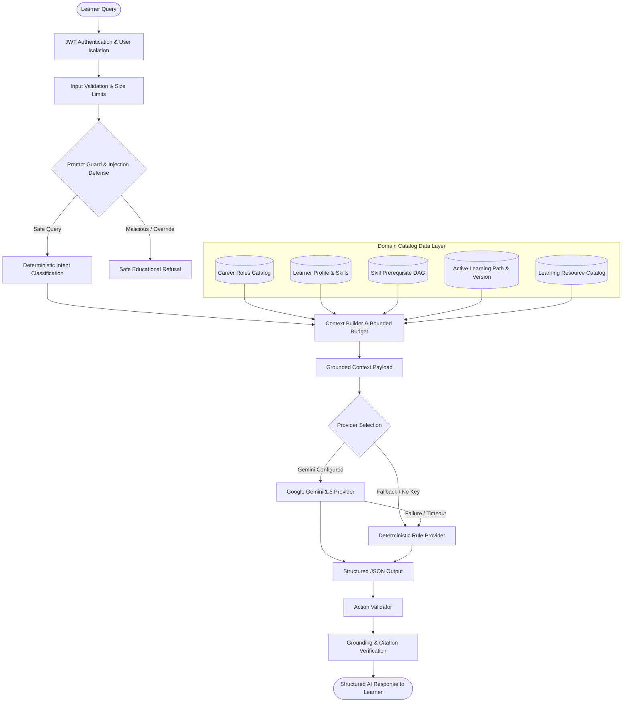

# PathFinder Domain-Agnostic AI Coach & Recommendation Architecture

## 1. System Overview & Core Invariant

PathFinder is built as a **fully domain-agnostic, FAANG-level career learning & recommendation platform**.

```
+-------------------------------------------------------------------------------+
|                        DOMAIN LAYER (CATALOG DATA)                           |
|  Career Roles | Target Skills | Prerequisite Edges | Resources | Metadata     |
+-------------------------------------------------------------------------------+
                                      |
                                      v
+-------------------------------------------------------------------------------+
|                       CORE ENGINES (DOMAIN-AGNOSTIC)                          |
|  - SkillDAG (Graph Traversal, Depth, Acyclicity Validation)                   |
|  - SkillGapEngine (Deficit Math: max(target - assessed, 0.0))                 |
|  - CandidateRetriever (Multi-signal Recursive Retrieval)                      |
|  - HardConstraintFilter (0.40 Threshold Prerequisite Boundary Enforcement)    |
|  - RecommendationScorer (8-Signal Hybrid Normalized Scoring Model)            |
|  - DeterministicRanker (4-Level Deterministic Tie-Breaking Policy)            |
|  - PathSequencer (Topological Depth & Metadata Pedagogical Phase Bucketing)   |
|  - AdaptiveEngine & RoadmapAdapter (Transactional Competency Adaptation)      |
|  - AICoach & Grounded Context Builder (Privacy-Safe Advisory LLM Layer)       |
+-------------------------------------------------------------------------------+
```

### The Architectural Invariant:
1. **Core Engines are 100% Domain-Agnostic**: All mathematical scoring, prerequisite DAG evaluation, candidate retrieval, diversity capping, topological sequencing, and adaptive state updates operate on generic graph structures, vector representations, and learner competency maps.
2. **Domain-Specific Knowledge Lives in Catalog Data**: Career definitions, skill taxonomies, prerequisite DAG edges, and learning resources are defined entirely in configuration / database seed catalogs.
3. **Adding a New Career Domain**: Adding a new engineering or professional domain (e.g. *VLSI Engineer*, *Cybersecurity Analyst*, *Robotics Engineer*, *Bioinformatics*) requires **ZERO code modifications** to core algorithms. It simply involves registering the career role and its skill DAG in the career catalog.

---

## 2. End-to-End Architectural Data Flow



---

## 3. How to Add a New Career Domain

To add a new career domain (e.g. **VLSI Engineer**):

1. **Define the Career Role** in `backend/app/core/career_catalog.py`:
   ```python
   CAREER_ROLES_CATALOG["vlsi-engineer"] = CareerRoleDefinition(
       role="VLSI Engineer",
       slug="vlsi-engineer",
       title="Become a VLSI Engineer",
       description="Master Digital Logic, Verilog, Computer Architecture, and Physical Design.",
       domain_category="Hardware Engineering",
       target_skills=["digital-logic", "verilog", "computer-architecture", "vlsi-design", "physical-design"]
   )
   ```
2. **Seed Skills & Prerequisite DAG Edges** in `backend/app/seed/catalog_data.py`:
   - `digital-logic` $	o$ `verilog`
   - `digital-logic` $	o$ `computer-architecture`
   - `verilog` $	o$ `vlsi-design`
   - `computer-architecture` $	o$ `vlsi-design`
   - `vlsi-design` $	o$ `physical-design`
3. **Seed Learning Resources** with target skill tags and difficulty levels.

**Zero core engine code changes are required.** The recommendation pipeline, skill-gap analysis, hard constraint filter, topological sequencer, adaptive learning engine, and AI coach immediately support the new domain seamlessly.
